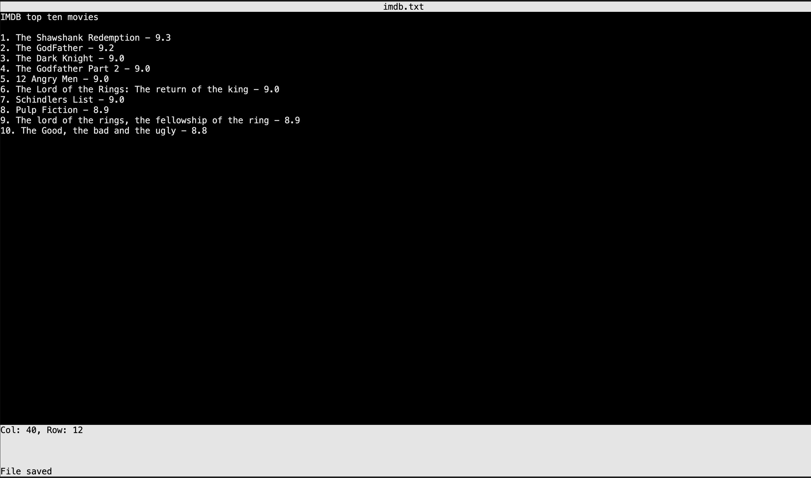

# Multi-Term Text Editor
## Roadmap
Multi-Term is a simple text editor built in Go. It aims to provide a lightweight and efficient text editing experience.



## Installation and usage
To use, pull the repository, and build

```sh
git clone https://github.com/HaroldObasi/multi-term.git
cd multi-term
go build
sudo mv multi-term /usr/local/bin
multi-term file.txt
```

if file.txt doesn't exist it will be created on the level the command is being ran

Ctrl + S to Save, Esc to quit app

## Roadmap

| Feature                                                   | Status        | 
| :----------------                                         | :------:      |
| Package the editor for download                           |  Ongoing ⏳   |
| Write some tests                                          |  Ongoing ⏳   |
| Handle editor window resize                               |  Ongoing ⏳   |
| Copy and paste Features                                   |  Ongoing ⏳   |
| Undo, redo and other keyboard shortcuts                   |  Ongoing ⏳   |
| Scroll Support (Vertical, and horizontal)                 |  Ongoing ⏳   |


## Contributing

Contributions are welcome! Please fork the repository and submit a pull request.